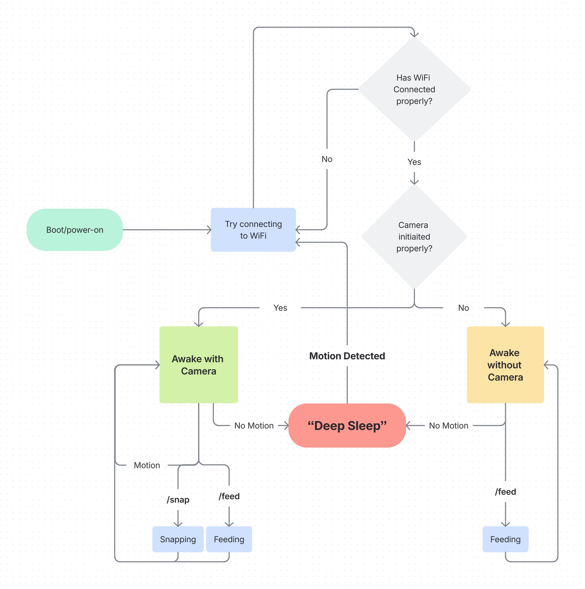

# Smart Cat Feeder – ESP32-CAM + PIR + Telegram

DIY smart cat feeder built on the **ESP32-CAM (AI-Thinker)**.  
Wakes on **PIR motion**, snaps a photo, and talks to you via the **Telegram Bot API**.  
Designed for **battery power** with deep-sleep and an **LM2596** buck for stable rails.  
All hardware listed below matches the gear currently on hand.

---

## ✨ Features

- 💤 **Ultra-low power**: deep-sleep most of the time, wake on PIR (EXT1).
- 👀 **Motion trigger**: PIR wakes the ESP → snapshot → Telegram alert.
- 📸 **Remote photo**: `/snap` command captures and returns a fresh image.
- 🚫 **Ignore**: `/ignore` acknowledges the trigger and logs it.
- 🍽️ **Servo hook (planned)**: `/feed` to drive MG996 360° servo for dispensing.
- 🔦 **(Optional) Flash LED**: brief flash for low-light capture.
- 🔐 **Minimal permissions**: bot is scoped to a single chat/group.

> **Note on extras:** Any feature requiring parts beyond the list below (e.g., buzzer/speaker for a deterrent sound) will be explicitly labeled **optional** and **requires additional hardware**.

---

## 🧱 Hardware (what’s actually in use)

- **ESP32-CAM + Antenna** (AI-Thinker)
- **PIR Sensors (3 pcs)** – e.g., HC-SR501 (one used)
- **Servo Motor MG996 – 360° Metal**
- **5× LM2596 Buck Modules** (one used)
- **Breadboards (3 pcs, 400 tie points)** (one used)
- **5× Rocker Switches** (one used as master power)
- **2× AA Battery Case (4-slot)** (one used for main pack)
- **1× AA Battery Case (4-slot)** (optionally used for PIR or servo rail)
- **Capacitors**  
  - **300 pcs ceramic kit** (0.1 µF etc.)  
  - **120 pcs electrolytic kit** (e.g., 470 µF bulk)
- **100 pcs 5 mm LEDs** (status/heartbeat)
- **Digital Multimeter DT9205A** (bring-up & debugging)
- **Plastic Organizer Box** (for sanity 😺)

> Everything above is already owned. If a step needs anything else, it will be called out explicitly as “extra”.

---

## 🔌 System Overview

```
[PIR OUT] --(RTC-capable pin)--> [ESP32-CAM]
                     |                |
                     |                +--> [WiFi -> Telegram Bot API]
                     |
                     +--> (optional) [Status LED / Flash control]
                     |
                     +--> (planned)  [MG996 360° Servo -> Feeder]
```

- **Flow**: PIR detects motion → ESP32 wakes from deep sleep → capture → send to Telegram.  
- **Chat control**: Send `/snap` for an on-demand image; `/ignore` to dismiss.  
- **Feeding (planned)**: `/feed` will rotate MG996 for a calibrated pulse.

---

## 🧭 Repository Layout

```
.
├─ firmware/
│  ├─ cat_feeder.cpp        # main sketch (ESP32-CAM + PIR + Telegram)
│  └─ platformio.ini        # (optional) if you use PlatformIO
├─ docs/
│  ├─ wiring.md             # detailed wiring and photos
│  └─ power_notes.md        # buck setup, caps, current notes
└─ README.md
```

*(If you’re using Arduino IDE only, you still keep `firmware/cat_feeder.cpp` as your sketch.)*

---

## 🔧 Build & Flash (Arduino IDE)

1. **Boards manager**: Install “ESP32 by Espressif Systems”.
2. **Board**: `AI Thinker ESP32-CAM`.
3. **Open**: `firmware/cat_feeder.cpp`.
4. **Edit credentials** in the sketch:
   ```cpp
   const char* WIFI_SSID     = "YOUR_WIFI";
   const char* WIFI_PASSWORD = "YOUR_PASS";
   const char* BOT_TOKEN     = "123456789:ABC..."; // from @BotFather
   const char* CHAT_ID       = "-1001234567890";   // your group/private chat id
   ```
5. **Programmer**: use the ESP32-CAM programmer/FTDI (IO0 → GND for flashing).
6. **Upload**, then remove IO0-GND and **reset** to run.

> Tip: Disable Bluetooth in code to save power (we do). It’s not used anywhere.

---

## 📲 Telegram Setup

1. In Telegram, open **@BotFather** → `/newbot` → copy **token**.
2. Add the bot to your **private group** (or DM).
3. Get **chat id** (e.g., via **@userinfobot** or a quick API call).
4. Paste token & chat id into the sketch (see Build & Flash).

**Commands available today**
- `/snap` → capture new photo
- `/ignore` → acknowledge and do nothing

**Planned**
- `/feed` → drive MG996 360° for a fixed duration (dispense)




---

## 🪫 Power & Wiring Notes (with the gear we have)

- **Buck (LM2596)**  
  - Set output to the **ESP32-CAM requirement** (typ. 5 V to 5V pin; onboard LDO makes 3.3 V).  
  - Add **0.1 µF ceramic** + **≥470 µF electrolytic** at the buck output (near rails).
- **PIR**  
  - You can power PIR from 5 V **or** its own AA pack (if you isolate rails).  
  - **Common ground is required** between any signal-sharing devices.
- **Servo (MG996 360°)**  
  - Prefer its **own 4×AA pack** (separate from ESP32-CAM), with **0.1 µF + 470 µF** across rails.  
  - Tie grounds together (servo GND ↔ ESP32-CAM GND) so the PWM reference is shared.
- **Decoupling pattern (breadboard rails)**  
  - Each rail: sprinkle **0.1 µF** ceramics every ~5–10 cm + one **bulk electrolytic** (≥220–470 µF).  
  - Keep camera and Wi-Fi spikes stable during TX.

> The **DT9205A multimeter** is perfect to confirm the LM2596 output is really 5.0 V and that droop under load is acceptable.

---

## 🧵 Pinout (AI-Thinker ESP32-CAM – as used here)

- **PIR OUT** → `GPIO13` (RTC-capable; used for **EXT1 wake**)
- **Servo signal (planned)** → `GPIO14`
- **(Optional) Flash LED / Status** → `GPIO4`

*(PIR Vcc → 5 V or its own pack; Servo Vcc → own 4×AA; both with common GND to ESP32-CAM.)*

---

## 🔒 Security Quick Tips

- Keep your **BOT_TOKEN** private. Do not commit it.
- Use a **private group** chat id (starts with `-100...`) or a one-to-one chat.
- Consider restricting who can send commands (chat id filtering is already in code).

---

## 🧪 Basic Test Procedure

1. Power up on bench supply or AA pack → check **5 V rail** on the buck.
2. Serial monitor @ 115200 → watch boot messages.
3. Trigger PIR (wave your hand) → device wakes, logs, and sends a **Telegram photo**.
4. Send `/snap` in chat → receive a fresh image.
5. Send `/ignore` → device acknowledges and resumes normal loop.

---

## 🐞 Troubleshooting

- **DMA overflow / capture failed**:  
  Lower frame size (e.g., `FRAMESIZE_SVGA → VGA/QVGA`) and try again. Ensure stable 5 V.
- **No Telegram messages**:  
  Check Wi-Fi credentials; verify chat id; token still valid; TLS handshake prints OK.
- **Random resets on Wi-Fi TX**:  
  Add more bulk capacitance on the 5 V rail; shorten wires; check buck thermal.

---

## 🗺️ Roadmap

- [x] PIR wake from deep sleep + snapshot
- [x] Telegram photo upload
- [x] `/snap` and `/ignore` commands
- [ ] `/feed` command to drive MG996 360°
- [ ] “Going back to sleep” Telegram status on deep-sleep entry
- [x] Motion “two-button” message (simulate trigger on boot for testing)
- [ ] Power profiling & sleep current reduction
- [ ] (Optional) Sound deterrent **(requires extra buzzer – not in current parts)**

---

## 📜 License

**MIT** — © Or Tarazi, 2025.  
Feel free to use, modify, and share. Attribution appreciated.

---

## 🙌 Acknowledgments

- ESP32-CAM community examples and docs  
- Telegram Bot API docs  
- Countless bench hours saved by the **DT9205A** multimeter 😄
